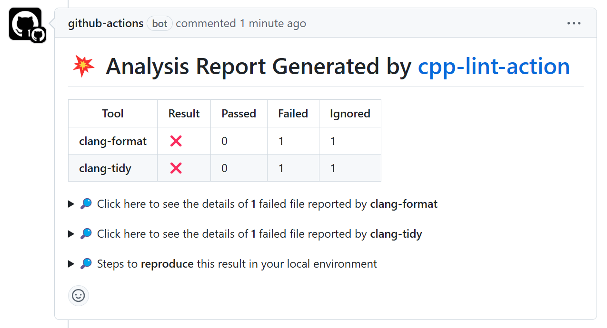

# cpp-lint-action


[](https://codecov.io/gh/emmett2020/cpp-lint-action)


cpp-lint-action is a tool used to check C++ code quality in Github workflow. It
relies on several code static analysis tools, supports multiple platforms, and
presents the results in various forms.

cpp-lint-action supports several C++ static code analysis tools. Currently, it supports [clang-format](https://github.com/llvm/llvm-project/tree/main/clang/tools/clang-format) and [clang-tidy](https://github.com/llvm/llvm-project/tree/main/clang-tools-extra/clang-tidy), and future versions will support cpplint and cppcheck. Both clang-format and clang-tidy have been verified to work on the Ubuntu versions currently supported by GitHub, so you can use them with confidence. You can find detailed supported platform and tools in [here](./docs/supports.md).

cpp-lint-action also presents the results in various forms. You can find all forms in [here](./docs/result_report.md).

**Welcome** to submit PRs, open issues, and provide usage feedback in the issues.

# Get started
Use cpp-lint-action on Github workflow is a easy thing.

Just add follow lines to your `.github/workflows/your_workflow_name.yml`
```yaml
- uses: emmett2020/cpp-linter@v1
  env:
    GITHUB_TOKEN: ${{ secrets.GITHUB_TOKEN }}
```

After the workflow is complete, you can see the following results displayed in the GitHub pull request review page.


You can find more comprehensive configurations and usage examples in the `examples/` directory.

# Develop cpp-lint-action
1. cpp-lint-action needs c++20 standard. Ensure your local compiler version supports it.
2. cpp-lint-action now supports Ubuntu only.
3. cpp-lint-action has two dependencies. You should install it before compilation.
```bash
sudo apt install -y libboost-all-dev libgit2-dev
```

4. Download this repository and build.
```bash
git clone https://github.com/emmett2020/cpp-lint-action.git
mkdir build && cd build
cmake ..
make -j`nproc`

```

5. Run unit tests
```bash
./build/tests/test
```

# How to use cpp-lint-action locally
Since cpp-lint-action is used for Github, you must set some environment variables to simulate Github CI environment.
```bash
export GITHUB_REPOSITORY="owner/repository"
export GITHUB_TOKEN="your_private_github_token"
export GITHUB_EVENT_NAME=pull_request
export GITHUB_WORKSPACE="/path/to/your/local/repo"
export GITHUB_REF="ref/pull/NUMBER/merge"
export GITHUB_SHA="test_branch_name_in_your_local_repository"

```

Then, just run cpp-lint-action
```bash
./build/cpp-lint-action
```
